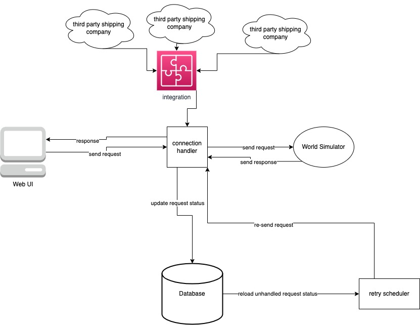

# Mini Amazon
## Project Description
This project aims to build an online shopping plateform that provide one stop shop experience to the user. In this plateform, there are two roles for a users, a buyer and a seller. For a buyer, they could browse items that are interested to them, order the item, and the item would be shipped to their house by the shipping service companies that collaborate with the platform. For a seller, they could post item to be sell. By adding the factory that the sellers work with to the system, they do not need to worry about inventory anymore, the system would automatically monitor and order more inventory based on sellers setting once the item is insufficient.
## Project Feature
* Built Connection API for application developers to use (abstract out the low level socket connection).
* Design Retry module to achieve Idempotence Operation for each request.
* Provide public API for shipping companies to integrate.
## Project Architecture

## Simulation
To test the accuracy of the app, we use an probided world server from [here](https://github.com/yunjingliu96/world_simulator_exec)
## Installation
### Package for Development
2. for coding error checking: [eslint]()
4. for template: [express-handlebars]()
5. for server: [express]()
